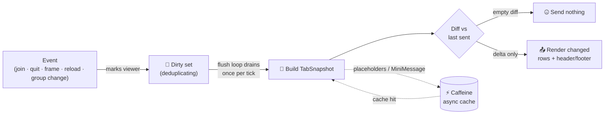
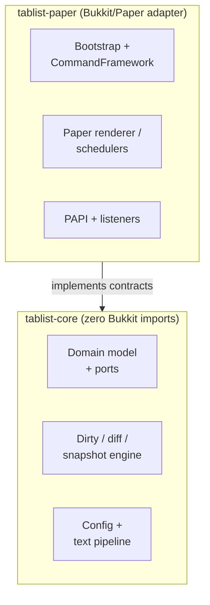

<div align="center">

# 👥 Tablist

### A high-performance, modular tab-list plugin for [Paper](https://papermc.io/) & [Folia](https://papermc.io/software/folia)

Animated header/footer · per-viewer placeholders · permission-based sorting — built on a
**dirty-flag + diff engine** that sends the client *nothing* when nothing changed.

<br/>

[](LICENSE)
[](https://adoptium.net/)
[](https://papermc.io/)
[](https://papermc.io/software/folia)
[](https://www.spigotmc.org/resources/placeholderapi.6245/)
[](#-why-its-fast)

</div>

---

## Table of contents

- [Why Tablist?](#-why-tablist)
- [Features](#-features)
- [Quick start](#-quick-start)
- [Commands & permissions](#-commands--permissions)
- [Configuration](#-configuration)
- [Placeholders](#-placeholders)
- [Why it's fast](#-why-its-fast)
- [Architecture](#-architecture)
- [Building from source](#-building-from-source)
- [Project layout](#-project-layout)
- [FAQ](#-faq)
- [Contributing](#-contributing)
- [License](#-license)

---

## 💡 Why Tablist?

Most tab-list plugins rebuild and re-broadcast the **entire** list to **every** player **every**
tick — work that scales with `players × tickrate` whether or not anything actually changed. Tablist
inverts that: cost scales with **change**, not with player count or tick rate. A fully static tab
list sends each player exactly one update and then goes **completely silent**.

That property isn't a happy accident — it's a hard contract pinned by a test that simulates 100
viewers for 60 seconds and asserts **zero** renders after the first cycle.

---

## ✨ Features

| | Feature | Details |
| :-: | --- | --- |
| 🎞️ | **Animated header & footer** | Cycle any number of [MiniMessage](https://docs.advntr.dev/minimessage/format.html) frames at a configurable interval. A single frame = a static line. |
| 🧩 | **Per-viewer placeholders** | Built-in `%player_name%`, `%online%`, `%ping%` — plus the full [PlaceholderAPI](https://www.spigotmc.org/resources/placeholderapi.6245/) catalogue when installed (optional, auto-detected). |
| 🪜 | **Permission-based sorting** | Order players by group via `tablist.group.<name>` permissions and configurable weights. |
| 😴 | **Truly idle when idle** | The diff engine sends a packet only for what actually changed. A static tab list costs **zero** updates per tick. |
| 🧵 | **Folia-ready** | Every player mutation is routed to that player's region thread. Runs unchanged on Paper *and* Folia. |
| 🎨 | **MiniMessage everywhere** | Colours, gradients and tags in every text field — including all command feedback. |
| 🚫 | **No NMS, no packets, no ProtocolLib** | Built entirely on the official Paper API. Survives version bumps. |
| 🎛️ | **Live runtime control** | `/tablist reload`, `status` and `toggle` act on the running instance — no restart. |
| 🧪 | **Unit-testable core** | Domain logic has **zero** Bukkit imports and is tested with plain JUnit, no server. |

---

## 🚀 Quick start

> **Requirements:** Paper (or Folia) **1.21+** · Java **21+** runtime.

1. **Get the jar** — download `Tablist-<version>-all.jar` (the shaded jar) from the
   [releases page](https://github.com/HanielCota/tablist/releases), or
   [build it yourself](#-building-from-source).
2. **Drop it** into your server's `plugins/` folder.
3. *(Optional)* install [PlaceholderAPI](https://www.spigotmc.org/resources/placeholderapi.6245/)
   to unlock external placeholders.
4. **Start the server.** A fully-commented `config.yml` is generated under `plugins/Tablist/`.
5. **Edit & reload** — tweak `config.yml`, then run `/tablist reload`. No restart required.

```bash
# Verify it loaded:
/tablist status
# → Viewers: 12 · Cache hit-rate: 98.4% · Updates/min: 60 · Frame: 1
```

---

## 🎮 Commands & permissions

All commands live under the single `/tablist` root.

| Command | Description | Permission |
| --- | --- | --- |
| `/tablist reload` | Reload `config.yml` atomically (safe — failures leave the running config intact). | `tablist.admin` |
| `/tablist status` | Show viewers, cache hit-rate, updates/min and the current animation frame. | `tablist.admin` |
| `/tablist toggle` | Toggle the custom tab list for yourself (falls back to the vanilla tab). | `tablist.use` |

| Permission | Purpose | Default |
| --- | --- | :-: |
| `tablist.admin` | Manage the plugin (reload, status). | `op` |
| `tablist.use` | Use player commands (toggle). | `true` |
| `tablist.group.<name>` | Place a player into the sorting group `<name>` — granted by your permissions plugin. | `false` |

---

## ⚙️ Configuration

The generated `config.yml` is fully commented. Every text field supports MiniMessage and placeholders.

<details open>
<summary><b>config.yml</b> — full reference</summary>

```yaml
# Header shown at the top of the tab list.
#   frames:         lines cycled in order to animate the header (one entry = static).
#   interval-ticks: how many server ticks each frame stays on screen (20 ticks = 1 second).
header:
  frames:
    - "<gradient:#00c6ff:#0072ff>Tablist</gradient>"
    - "<gradient:#0072ff:#00c6ff>Tablist</gradient>"
  interval-ticks: 20

# Footer shown at the bottom of the tab list. Same format as `header`.
footer:
  frames:
    - "<gray>Online: <white>%online%</white></gray>"
  interval-ticks: 20

# How each player's name is rendered in the list.
#   prefix/suffix wrap the name; all three support MiniMessage and placeholders.
name-format:
  prefix: ""
  name: "<white>%player_name%</white>"
  suffix: ""

# Sorting groups, matched against the tablist.group.<name> permission.
# Weight is a rank: the LOWER the weight, the higher up the tab list the group
# appears (so admin sits above default). A player in no group sorts with "default".
sorting:
  - group: "admin"
    weight: 0
  - group: "default"
    weight: 100

# Periodic refresh of placeholder values.
refresh:
  # How often (in seconds) placeholders are re-resolved. Minimum 1, default 3.
  placeholder-refresh-seconds: 3

# Command feedback. All MiniMessage; nothing the commands say is hardcoded.
#   reload-error supports <error>
#   status supports <viewers>, <hitrate>, <updates>, <frame>
messages:
  reload-success: "<green>Tablist configuration reloaded.</green>"
  reload-error: "<red>Reload failed: <error></red>"
  status: "<gray>Viewers: <white><viewers></white> · Cache hit-rate: <white><hitrate></white> · Updates/min: <white><updates></white> · Frame: <white><frame></white></gray>"
  toggle-on: "<green>Custom tab list enabled.</green>"
  toggle-off: "<yellow>Custom tab list disabled — showing the vanilla tab.</yellow>"
```

</details>

### Key sections at a glance

| Section | What it controls | Notes |
| --- | --- | --- |
| `header` / `footer` | The animated lines above/below the player list. | One frame = static. `interval-ticks` is per-frame (20 ticks ≈ 1 s). |
| `name-format` | How each player row is rendered. | `prefix` + `name` + `suffix`, all MiniMessage + placeholders. |
| `sorting` | Group order in the list. | **Lower weight = higher up.** Ungrouped players fall back to `default`. |
| `refresh` | Placeholder re-resolution cadence. | `placeholder-refresh-seconds` ≥ 1. Drives the Caffeine cache window. |
| `messages` | All command feedback. | Pure MiniMessage; uses `<placeholder>` tags for dynamic values. |

---

## 🔤 Placeholders

| Placeholder | Source | Available |
| --- | --- | --- |
| `%player_name%` | Built-in | Always |
| `%online%` | Built-in (current online count) | Always |
| `%ping%` | Built-in (viewer's latency) | Always |
| `%<any_papi_placeholder>%` | [PlaceholderAPI](https://www.spigotmc.org/resources/placeholderapi.6245/) | When PlaceholderAPI is installed |

Resolution is **per viewer** and cached per `(viewer, template)` for the refresh window, so even an
expensive PAPI expansion is computed at most once per cycle per player.

---

## 🏎️ Why it's fast

Three mechanisms combine so that **cost scales with change**, not with player count or tick rate.



- **🚩 Dirty flag (coalescing).** Anything that can change a tab list marks the affected viewer
  *dirty* in a deduplicating set. A viewer marked fifty times between flushes is rendered at most
  **once**. The flush loop drains and clears the set atomically each tick, so producers on other
  threads keep marking while a flush is in progress.

- **📸 Snapshot diff.** For each dirty viewer the engine builds an immutable `TabSnapshot` (rows +
  header/footer) and diffs it against the last snapshot actually sent to that client. The renderer
  receives **only the delta**. An unchanged snapshot produces an empty diff, and **an empty diff is
  never handed to the renderer** — so a static configuration sends every player their tab list
  exactly once and then goes silent. *(Locked down by a 100-viewer / 60-second zero-render test.)*

- **⚡ Caffeine-cached resolution.** Resolving placeholders and parsing MiniMessage is the expensive
  part. Each `(viewer, template)` is resolved once per refresh window and cached in an async
  [Caffeine](https://github.com/ben-manes/caffeine) cache; a slow async resolver never blocks the
  flush — it simply marks the viewer dirty for the next cycle when it completes. The cache's hit-rate
  is visible in `/tablist status`.

---

## 🏛️ Architecture

Tablist is split into a **platform-agnostic core** and a **thin Paper adapter**, so domain logic is
unit-testable without a running server and a future port to another platform stays cheap.



| Module | Responsibility | Bukkit/Paper? |
| --- | --- | :-: |
| `tablist-core` | Domain types, contracts (ports) and all logic — dirty/diff/cache/config/text. | ❌ **Zero** Bukkit imports |
| `tablist-paper` | Paper adapter: implements the core ports, bootstraps the plugin, wires the `/tablist` command. | ✅ |

**Tech stack:** Java 25 (toolchain) · [Configurate](https://github.com/SpongePowered/Configurate)
(YAML) · [Adventure / MiniMessage](https://docs.advntr.dev/) ·
[Caffeine](https://github.com/ben-manes/caffeine) ·
[CommandFramework](https://github.com/HanielCota/CommandFramework) · JUnit 5 + Mockito.

---

## 🔨 Building from source

```bash
./gradlew build                      # compile, test, javadoc, Spotless check — both modules
./gradlew :tablist-paper:shadowJar   # the deployable plugin jar (…-all.jar)
./gradlew spotlessApply              # auto-format to Google Java Format (2 spaces, 100 cols)
```

The build uses a Gradle **toolchain**, so a matching **Java 25** JDK is provisioned/selected
automatically — no local Gradle install needed, just the bundled wrapper (`./gradlew`).

> **On the Paper version:** PaperMC moved away from `1.x` artifact naming after `1.21.11`; the
> current stable line is calendar-versioned (`26.1.x`). The target resolves to the `paper-api`
> coordinate pinned in [`gradle/libs.versions.toml`](gradle/libs.versions.toml). Update it (and the
> `api-version` in `paper-plugin.yml`) to match the exact build you deploy to.

---

## 🗂️ Project layout

```text
tablist/
├── tablist-core/                    # platform-agnostic domain + logic (no Bukkit)
│   └── src/main/java/.../core/
│       ├── config/                  # config model, loader, reloader
│       ├── model/                   # TabEntry, TabSnapshot, Frames, …
│       ├── port/                    # contracts the adapter implements
│       ├── state/                   # dirty tracker, diff, snapshot store, flusher
│       ├── status/                  # /tablist status reporting
│       └── text/                    # placeholder resolution + MiniMessage pipeline
└── tablist-paper/                   # Paper/Folia adapter
    └── src/main/java/.../paper/
        ├── bootstrap/               # plugin + CommandFramework wiring
        ├── command/                 # /tablist reload|status|toggle controllers
        ├── listener/                # join/quit → dirty
        ├── placeholder/             # built-in + PlaceholderAPI resolvers
        ├── render/                  # Paper tab renderer + list sorters
        ├── scheduler/               # Bukkit + Folia schedulers
        └── snapshot/                # Paper snapshot source
```

---

## ❓ FAQ

<details>
<summary><b>Does it work on Folia?</b></summary>

Yes. Every player mutation is routed to that player's region thread, so the same jar runs unchanged
on both Paper and Folia.
</details>

<details>
<summary><b>Do I need PlaceholderAPI?</b></summary>

No. The built-in resolver (`%player_name%`, `%online%`, `%ping%`) is always available. PlaceholderAPI
is a soft dependency — when present it's auto-detected and its full placeholder catalogue becomes
available; when absent the plugin runs normally.
</details>

<details>
<summary><b>Is there any NMS / packet / ProtocolLib dependency?</b></summary>

None. Tablist is built entirely on the official Paper API, so it doesn't break on Minecraft updates
the way packet-level plugins do.
</details>

<details>
<summary><b>Why does <code>/tablist status</code> show such low updates/min?</b></summary>

That's the point — the diff engine only sends what changed. A static configuration settles to zero
renders after the first cycle, and an animated one costs roughly one update per frame advance.
</details>

<details>
<summary><b>How does sorting weight work?</b></summary>

**Lower weight = higher up the list.** A group at weight `0` sits above one at weight `100`. Players
without any `tablist.group.<name>` permission sort with the `default` group.
</details>

---

## 🤝 Contributing

Issues and pull requests are welcome — see [CONTRIBUTING.md](CONTRIBUTING.md). Run `./gradlew build`
(green) and `./gradlew spotlessApply` before opening a PR.

---

## 📄 License

[MIT](LICENSE) © 2026 Haniel Fialho.

<div align="center">
<sub>Built with ⚡ for servers that care about every tick.</sub>
</div>
